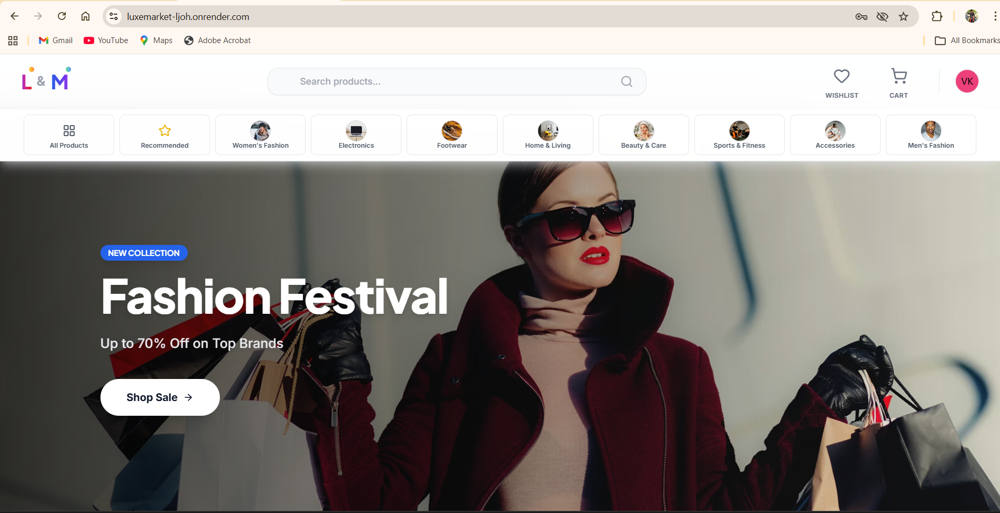

# LuxeMarket 🛍️

<div align="center">

<div align="center">
  
</div>

**A Premium E-Commerce Experience built with the MERN Stack**

[Live Demo](https://luxemarket-ljoh.onrender.com) | [Report Bug](https://github.com/venkatdev-27/E-commerce-mern-stack/issues) | [Request Feature](https://github.com/venkatdev-27/E-commerce-mern-stack/issues)

</div>

---

## 📖 About The Project

LuxeMarket is a sophisticated, full-stack e-commerce application designed to provide a seamless shopping experience. Built with performance and scalability in mind, it features a highly responsive frontend, a powerful admin dashboard for business management, and a robust backend API.

Unlike standard e-commerce templates, LuxeMarket includes advanced features like real-time flash sale timers, optimized homepage structured rendering, and a dedicated wishlist system.

### Key Highlights
*   ⚡ **High Performance**: Optimized homepage loads in under 1 second.
*   📱 **Fully Responsive**: Mobile-first design ensuring a great experience on all devices.
*   🔒 **Secure**: JWT authentication and protected routes for users and admins.
*   🎨 **Modern UI**: Styled with Tailwind CSS for a clean, premium look.

---

## 🚀 Features

### 🛒 Customer Frontend
*   **Dynamic Homepage**: Features Flash Sales with countdown timers, Best Sellers, and personalized "Just For You" recommendations.
*   **Advanced Product Filtering**: Filter by category, price, and ratings.
*   **Wishlist & Cart**: Persistent cart and wishlist functionality for prolonged shopping sessions.
*   **User Profiles**: Manage orders, saved addresses, and personal details.
*   **Secure Checkout**: Integrated payment processing flow.

### 💼 Admin Dashboard
*   **Analytics Dashboard**: Real-time overview of sales, orders, and user growth.
*   **Product Management**: comprehensive CRUD operations for products with image upload support.
*   **Order Fulfillment**: Track and update order statuses (Processing, Shipped, Delivered).
*   **Customer Support**: Integrated support ticket system to manage user inquiries.

---

## 🛠️ Tech Stack

### Frontend
*   **Framework**: [React.js](https://reactjs.org/) (Vite)
*   **State Management**: [Redux Toolkit](https://redux-toolkit.js.org/)
*   **Styling**: [Tailwind CSS](https://tailwindcss.com/) & [Lucide React](https://lucide.dev/) (Icons)
*   **HTTP Client**: [Axios](https://axios-http.com/)

### Backend
*   **Runtime**: [Node.js](https://nodejs.org/) & [Express.js](https://expressjs.com/)
*   **Database**: [MongoDB](https://www.mongodb.com/) (Mongoose ODM)
*   **Authentication**: JSON Web Tokens (JWT)
*   **Email Service**: [SendGrid](https://sendgrid.com/) / [Nodemailer](https://nodemailer.com/)

---

## 🏁 Getting Started

Follow these steps to set up the project locally.

### Prerequisites
*   Node.js (v16+)
*   MongoDB (Local or Atlas)
*   Git

### Installation

1.  **Clone the repository**
    ```bash
    git clone https://github.com/venkatdev-27/E-commerce-mern-stack.git
    cd luxemarket
    ```

2.  **Install Dependencies**

    *Backend:*
    ```bash
    cd backend
    npm install
    ```

    *Frontend:*
    ```bash
    cd frontend
    npm install
    ```

3.  **Environment Configuration**
    Create `.env` files in both `backend` and `frontend` directories.

    **backend/.env**
    ```env
    PORT=5000
    MONGO_URI=your_mongodb_connection_string
    JWT_SECRET=your_jwt_secret
    SENDGRID_API_KEY=your_sendgrid_key
    ```

    **frontend/.env**
    ```env
    VITE_API_URL=http://localhost:5000
    ```

4.  **Run the Application**

    *Start Backend:*
    ```bash
    cd backend
    npm start
    ```

    *Start Frontend:*
    ```bash
    cd frontend
    npm run dev
    ```

---

## 🤝 Contributing

Contributions are what make the open-source community such an amazing place to learn, inspire, and create. Any contributions you make are **greatly appreciated**.

1.  Fork the Project
2.  Create your Feature Branch (`git checkout -b feature/AmazingFeature`)
3.  Commit your Changes (`git commit -m 'Add some AmazingFeature'`)
4.  Push to the Branch (`git push origin feature/AmazingFeature`)
5.  Open a Pull Request

---

## 📞 Contact

**Project Link**: [https://github.com/venkatdev-27/E-commerce-mern-stack](https://github.com/venkatdev-27/E-commerce-mern-stack)

<div align="center">
  
</div>
